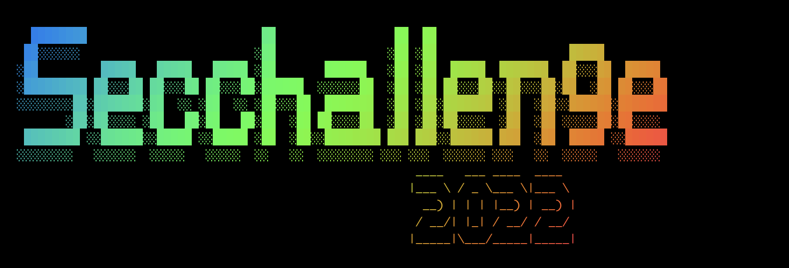

# CrySyS Security Challenge 2022

Organized by the Laboratory of Cryptography and System Security (CrySyS Lab) of 
Budapest University of Technology and Economics, an annual CTF event for students
and hobbyists.

[website](https://secchallenge.crysys.hu)

## Writeups:

- [crypto/encrypted-display-control](./crypto/encrypted-display-control/solution/README.md)
- [crypto/grannygma](./crypto/grannygma/solution/README.md)
- [crypto/vpscoin](./crypto/vpscoin/solution/README.md)
- [hardware/drive-to-checkered-flag](./hardware/drive-to-checkered-flag/solution/README.md)
- [hardware/flagshift](./hardware/flagshift/solution/README.md)
- [hardware/martian-quest-the-terraformation](./hardware/martian-quest-the-terraformation/solution/README.md)
- [misc/dangerous-volcano](./misc/dangerous-volcano/solution/README.md)
- [reverse/falleen-system](./reverse/falleen-system/solution/README.md)
- [reverse/layers](./reverse/layers/solution/README.md)
- [web/instant-development-company](./web/instant-development-company/solution/README.md)
- [web/note-keeper](./web/note-keeper/solution/README.md)
- [web/snek](./web/snek/solution/README.md)
- [web/waffles](./web/waffles/solution/README.md)
