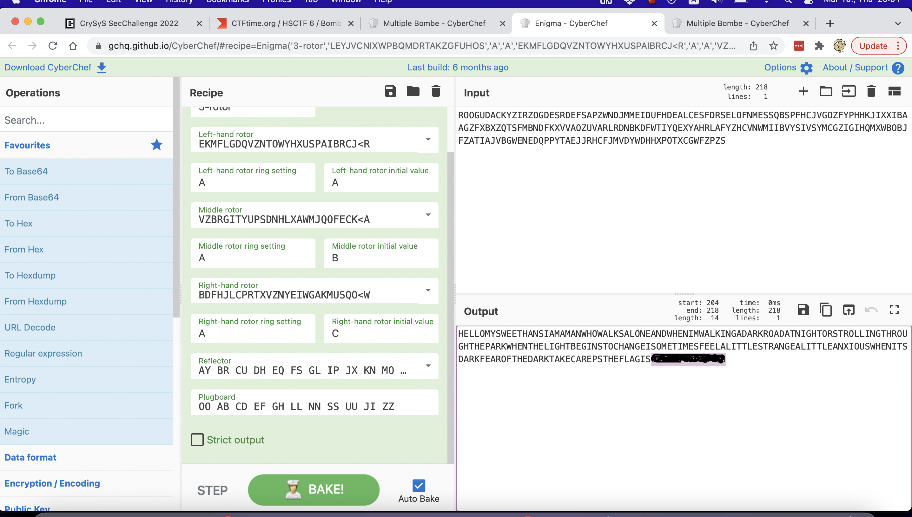

# GRANNYGMA

I found a nice resource on Enigma hacking here:

https://github.com/gchq/CyberChef/wiki/Enigma,-the-Bombe,-and-Typex#what-if-i-dont-know-the-rotors

Then just went to [this page](https://gchq.github.io/CyberChef/#recipe=Multiple_Bombe('German%20Service%20Enigma%20(First%20-%203%20rotor)','EKMFLGDQVZNTOWYHXUSPAIBRCJ%3CR%5CnAJDKSIRUXBLHWTMCQGZNPYFVOE%3CF%5CnBDFHJLCPRTXVZNYEIWGAKMUSQO%3CW%5CnESOVPZJAYQUIRHXLNFTGKDCMWB%3CK%5CnVZBRGITYUPSDNHLXAWMJQOFECK%3CA','','AY%20BR%20CU%20DH%20EQ%20FS%20GL%20IP%20JX%20KN%20MO%20TZ%20VW','HELLO%20MY%20SWEET%20HANS',0,true)&input=Uk9PR1VEQUNLWVpJUlpPR0RFU1JERUZTQVBaV05ESk1NRUlEVUZIREVBTENFU0ZEUlNFTE9GTk1FU1NRQlNQRkhDSlZHT1pGWVBISEtKSVhYSUJBQUdaRlhCWFpRVFNGTUJOREZLWFZWQU9aVVZBUkxSRE5CS0RGV1RJWVFFWFlBSFJMQUZZWkhDVk5XTUlJQlZZU0lWU1lNQ0daSUdJSFFNWFdCT0JKRlpBVElBSlZCR1dFTkVEUVBQWVRBRUpKUkhDRkpNVkRZV0RISFhQT1RYQ0dXRlpQWlM) to find some initial Enigma settings using multi bombs.

 

Then switched to an [enigma](https://gchq.github.io/CyberChef/#recipe=Enigma('3-rotor','LEYJVCNIXWPBQMDRTAKZGFUHOS','A','A','EKMFLGDQVZNTOWYHXUSPAIBRCJ%3CR','A','A','VZBRGITYUPSDNHLXAWMJQOFECK%3CA','A','B','BDFHJLCPRTXVZNYEIWGAKMUSQO%3CW','A','C','AY%20BR%20CU%20DH%20EQ%20FS%20GL%20IP%20JX%20KN%20MO%20TZ%20VW','OO%20AB%20CD%20EF%20GH%20LL%20NN%20SS%20UU%20JI%20ZZ',false)&input=Uk9PR1VEQUNLWVpJUlpPR0RFU1JERUZTQVBaV05ESk1NRUlEVUZIREVBTENFU0ZEUlNFTE9GTk1FU1NRQlNQRkhDSlZHT1pGWVBISEtKSVhYSUJBQUdaRlhCWFpRVFNGTUJOREZLWFZWQU9aVVZBUkxSRE5CS0RGV1RJWVFFWFlBSFJMQUZZWkhDVk5XTUlJQlZZU0lWU1lNQ0daSUdJSFFNWFdCT0JKRlpBVElBSlZCR1dFTkVEUVBQWVRBRUpKUkhDRkpNVkRZV0RISFhQT1RYQ0dXRlpQWlM) emulator and entered some of the potential settings coming out from the first step.

It was almost perfectly decrypted, I just had to add `JI` to the plugboard settings to get the flag `cd22{REDACTED}`

