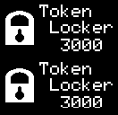

# Broken

I used [Logic 2](https://www.saleae.com/downloads/) to solve a hardware challenge last year. This year we had a different protocol, but the same tool was capable to translate the .sal file to something easier to handle.

Logic 2 has several protocol analyzers, although somewhat hidden in the right sidebar, I selected I2C, exported to CSV and got a nice table of events:

```
name,type,start_time,duration,"ack","address","read","data"
"I2C","start",0.892847542,4.16666667e-08,,,,
"I2C","address",0.892855167,8.67916667e-05,true,0x3C,false,
"I2C","stop",0.892949792,4.16666667e-08,,,,
"I2C","start",0.8943895,4.16666667e-08,,,,
"I2C","address",0.894397083,8.68333333e-05,true,0x3C,false,
"I2C","data",0.894489042,8.67916667e-05,true,,,0x00
"I2C","data",0.894580917,8.68333333e-05,true,,,0xAE
"I2C","data",0.894672875,8.67916667e-05,true,,,0xD5
"I2C","data",0.894764792,8.67916667e-05,true,,,0x80
...
````

The IC from the challenge has been around for a while and used in multiple CTF contests, so there is a lot of sample code to emulate its behavior.

We have two displays each with a separate address. A display has 64 x 132 monochrome pixels. The 64 vertical pixels are divided to 8 rows (called pages), each row is 8 pixels tall and controlled by a single byte of data which is layed out vertically:

```
              col0   col1           col131

              b0_0   b1_0           b131_0
              b0_1   b1_1           b131_1
              b0_2   b1_2           b131_2
 page_0       b0_3   b1_3   ....    b131_3
              b0_4   b1_4           b131_4
              b0_5   b1_5           b131_5 
              b0_6   b1_6           b131_6 
              b0_7   b1_7           b131_7

              b0_0   b1_0           b131_0
              b0_1   b1_1           b131_1
              b0_2   b1_2           b131_2
 page_1       b0_3   b1_3   ....    b131_3
              b0_4   b1_4           b131_4
              b0_5   b1_5           b131_5 
              b0_6   b1_6           b131_6 
              b0_7   b1_7           b131_7
   .
   .
   .

              b0_0   b1_0           b131_0
              b0_1   b1_1           b131_1
              b0_2   b1_2           b131_2
 page_7       b0_3   b1_3   ....    b131_3
              b0_4   b1_4           b131_4
              b0_5   b1_5           b131_5 
              b0_6   b1_6           b131_6 
              b0_7   b1_7           b131_7
```

The IC is controlled by selecting a page and a starting column, then sending data to it.  The start colum is used when you don't want to refresh the whole page just a part of it, say from column 8. 

I have divided the input into multiple blocks from `"I2C","start"` to `"I2C","stop"`. The first line of each block was an "address" specifier, the subsequent lines are "data". 

There are two kind of blocks: control blocks and display blocks. The block kind can be determined based on the first data byte. 0x00 for control blocks, and 0x40 for a display blocks.

The subsequent lines of a control block are diverse, but we just care about the page and the start column settings and ignore everything else.

If d is the current data byte, the page is set with:
``` python
    if 0xb0 <= d <= 0xb7:
        page = d & 0x0f
```

And the start column:
``` python
    if d < 0x10:
        d = d & 0x0f
        col = (col & 0xf0) | (d << 0)
    elif d < 0x20:
        d = d & 0x0f
        col = (d << 4) | (col & 0x0f)
```

(The start column doesn't fit into a single data byte, the low and high nibbles come separated.)

Data blocks are more simple, they start with the mentioned `0x40` block designator and contain the pixel data.

The whole logic is duplicated because of the two displays. The address of the upper one is 0x3c, and the other one is 0x3d, so you need to care about two 'pages' and 'start columns' as well.

I created a short python script and generated a list of frames, each in a separate png, finally merged them in the following .gif:



The last frame of the gif is two QR codes containing the flag, but to get that one, you need to solve the challenge on your own.
