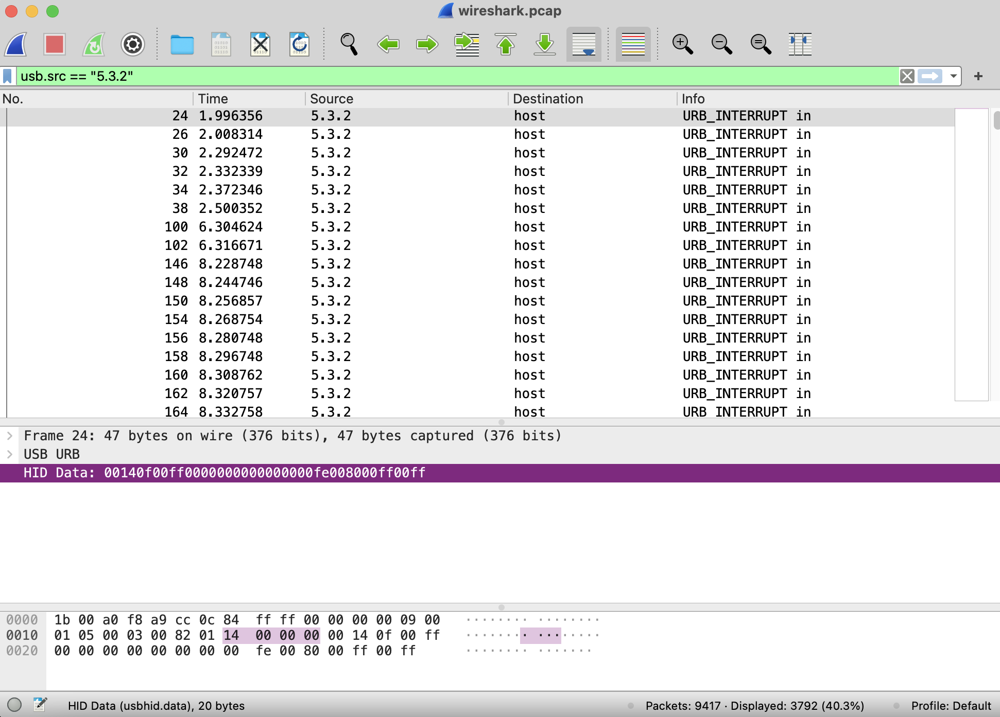
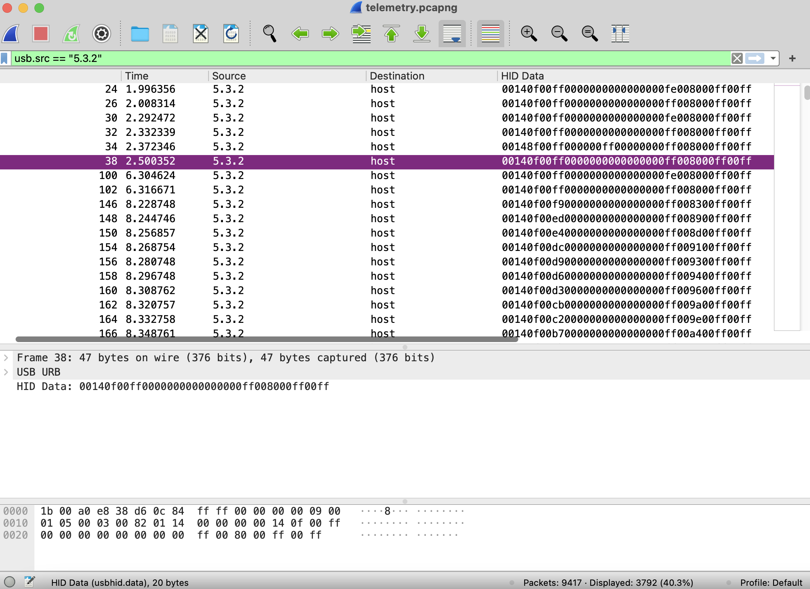

# Drive to checkered flag

Open the provided telemetry file in Wireshark. You will find two USB devices, one of them is a keyboard (address 5.4), the other one is an unknown device (5.3).

Filter for the second device with `usb.src == "5.3.2"` in Wireshark. 



If you look at the HID data (bottom) it resembles to the data of an XBOX controller, at least it stars with 0014... and has the right length. Is this the telemetry data of the steering wheel? 

We can show all the HID data in a column in Wireshark to make it more easy for the eye:


Let's export this with `File / Export Packet Dissections / As CSV...`.

Looking at the data and the video side by side, one can recognize that when the driver pushes buttons on the wheel the HID data changes. (I couldn't find this but after the contest I asked for help from the organizers.) 

It turns out that we need to check the low 4 bits of the second byte:

```
                  v
"14.905213","00140f00ff00000000000000ff18008000ff00ff"
"14.993223","00140f00ff00000000000000ff1a008000ff00ff"
"15.005272","00140f00ff00000000000000ff18008000ff00ff"
"15.033221","00140400ff00000000000000ff18008000ff00ff"
"15.073231","00140400ff00000000000000ff1a008000ff00ff"
"15.085227","00140400ff00000000000000ff18008000ff00ff"
"15.161234","00140f00ff00000000000000ff18008000ff00ff"
"15.173239","00140f00ff00000000000000ff1a008000ff00ff"
"15.213239","00140f00ff00000000000000ff18008000ff00ff"
"15.225263","00140f00ff00000000000000ff1a008000ff00ff"
                  ^
```

At 15.033221 it changes from f to 4 then quickly reset to f. Let's zoom to that column:

```shell
> cat input.csv | awk -F '"' '{print substr($4, 6, 1)}' | uniq > signal
> cat signal | head
f
4
f
0
f
0
f
4
f
4
...
```
It seems that it's a sequence of f, 4 and 0. Let's check this:
```shell
> cat signal | sort | uniq
0
4
f
```
Indeed, there are only 3 different values. `f` seems to be the separator between data bits. Let's translate `4 -> 0`, `0 -> 1` and delete the new lines:

```shell
> cat signal | tr -s "40f" "01\n" | tr -d "\n" > bits
> cat bits
 011000110110010000110010001100100111101101110000011011000011001100110100011100110011001101011111011011100011000001011111011100110011010001100....
 ```

 It looks like ASCII code. In fact it is ASCII, and we can add some grouping to make it more visible:

 ```shell
 > cat bits | sed -e "s/.\{8\}/& /g" > chars
 > cat chars
 01100011 01100100 00110010 00110010 01111011 ....
 ```

All left is to convert it back to chars. I have found some perl magic to complete our bash only analysis:

```shell
> cat chars | perl -lape '$_=pack"(B8)*",@F'
cd22{REDACTED}
```

¯\\_(ツ)_/¯
