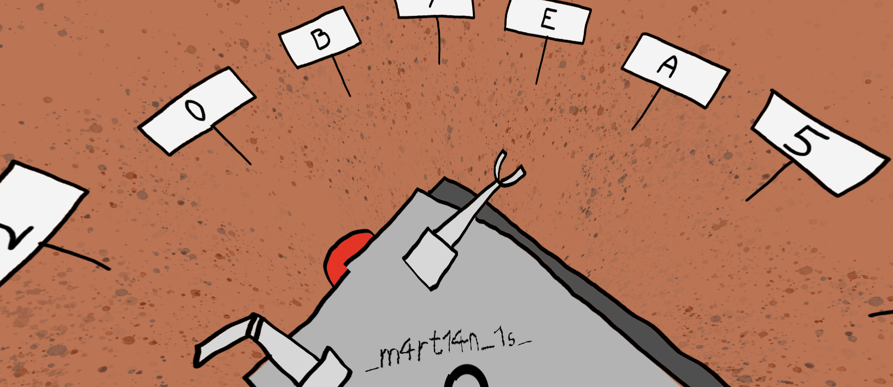

# Martian quest 

Open the capture file in Wireshark and start analyzing the content to see that the challenge server probably uses the Mqtt protocol.

The captured transmission contains a few username/passwords pairs, but only one of them works:

```
> mosquitto_sub -h nasa.secchallenge.crysys.hu -p 5010  -u XXXX -P YYYY -t '#'
Connection error: Connection Refused: not authorised.

> mosquitto_sub -h nasa.secchallenge.crysys.hu -p 5010  -u MarkWatney -P SpacePirate -t '#'
339.2601836365461 49.766756025378605
0.0
5.024
243.69
82.46
...

```

Let's create some aliases to simplify the latter commands:

```
> alias mars_cmd='mosquitto_rr -h nasa.secchallenge.crysys.hu -p 5010  -u MarkWatney -P SpacePirate -e  'nasa/marsrover/pathfinder/response'  -t 'nasa/marsrover/pathfinder/request' -m'

> alias mars_sub='mosquitto_sub -h nasa.secchallenge.crysys.hu -p 5010  -u MarkWatney -P SpacePirate'
```

We can issue commands with `mars_cmd`:

```
> mars_cmd helpn
Available commands: help, list, status, crew
```

Credits to the authors:
```
> mars_cmd crew
Created by gb and veloxer
```

Available topics:
```
> mars_cmd list
Available topics:
	nasa/marsrover/pathfinder/position
	nasa/marsrover/pathfinder/velocity
	nasa/marsrover/pathfinder/camera_angle
	nasa/marsrover/pathfinder/temperature
	nasa/marsrover/pathfinder/battery
	nasa/marsrover/pathfinder/request
	nasa/marsrover/pathfinder/response
	$nasa/marsrover/pathfinder/admin/hint
	nasa/marsrover/pathfinder/camera
```

We can also listen to the admin topic, to get some hints about the challenge. You might need to wait a minute or two until the first message arrives, but it will slowly fill the screen.

```
> mars_sub -t $nasa/marsrover/pathfinder/admin/hint
```

## Part 1/4:
Let's collect some coordinates first:

```
> mars_sub -t 'nasa/marsrover/pathfinder/position' -v
nasa/marsrover/pathfinder/position 339.2601836365461 49.766756025378605
nasa/marsrover/pathfinder/position 339.2601836365461 49.766756025378605
nasa/marsrover/pathfinder/position 339.2601836365461 49.766756025378605
...
nasa/marsrover/pathfinder/position 339.2601836365461 49.766756025378605
nasa/marsrover/pathfinder/position 339.25994793742893 49.76674507961799
nasa/marsrover/pathfinder/position 339.2599452552199 49.76674569918943
nasa/marsrover/pathfinder/position 339.2599415671825 49.766745286141784
nasa/marsrover/pathfinder/position 339.25993821442125 49.76674425352275
```

The rover is stationary at the beginning, but soon after (few minutes) starts moving. Collect these positions and create a Csv file. This can be uploaded to Google maps and the trace points reveal the first part of our flag `cd22{REDACTED`.


## Part 2/4:
The `status` command seemingly returns `0`: 

```
> mars_cmd status
0
```

but this is only because `mars_cmd` waits for the first reply only. Use `mars_sub` instead to grab some more:

```
mars_sub -t 'nasa/marsrover/pathfinder/response' -N
```

This will start listening to the topic. Use an other window to trigger the transmission:

```
mars_cmd status
```

Back in the first window we get a bunch of zeros and ones. The bits can be translated to the following morse code:

```
....- ..--.- .--. ...-- .-. ..-. ...-- -.-. - ..--.- .....
```

Which is decoded to `REDACTED`.

## Part 3/4:

The system broadcasts an image on the `camera` topic every few minutes:

```
> mars_sub -t nasa/marsrover/pathfinder/camera -C 1 > camera.png
```


Opening it in a panorama image viewer gives us an other part of the flag.



## Part 4/4:

The image contains the hexadecimal alphabet. It's scattered around the Mars rover in a way that is a clear a reference to the Martian movie. Mark and the Nasa communicated in hexadecimally encoded ASCII code with pointing the camera to the digits one by one.

Let's collect some more information about the angle and velocity to a file called `camera_data`. (Wait for a few minutes.)

```
> mars_sub -t nasa/marsrover/pathfinder/camera_angle -t nasa/marsrover/pathfinder/velocity -v > camera_data
```

Take those `camera_angle`-s when velocity is zero to get something like this:

```
> cat camera_data | grep "velocity 0.0" -A 1 | grep camera_angle
nasa/marsrover/pathfinder/camera_angle 3.6895
nasa/marsrover/pathfinder/camera_angle 3.611
nasa/marsrover/pathfinder/camera_angle 3.5325
nasa/marsrover/pathfinder/camera_angle 3.5325
nasa/marsrover/pathfinder/camera_angle 3.5325
nasa/marsrover/pathfinder/camera_angle 3.5325
nasa/marsrover/pathfinder/camera_angle 3.5325
nasa/marsrover/pathfinder/camera_angle 3.611
nasa/marsrover/pathfinder/camera_angle 3.6895
nasa/marsrover/pathfinder/camera_angle 3.768
...
```

The number in the second column is the angle in radians `[0..2 * Pi]`. We see that the camera rotates a bit then stops for a few seconds. Let's group the repetitions with `uniq`:

```
> cat camera_data | grep "velocity 0.0" -A 1 | grep camera_angle |  uniq -c
   1 nasa/marsrover/pathfinder/camera_angle 3.6895
   1 nasa/marsrover/pathfinder/camera_angle 3.611
   5 nasa/marsrover/pathfinder/camera_angle 3.5325
   1 nasa/marsrover/pathfinder/camera_angle 3.611
   1 nasa/marsrover/pathfinder/camera_angle 3.6895
   1 nasa/marsrover/pathfinder/camera_angle 3.768
   ...
```

Keep only those where the repetion count is either 5 or 20:

```
> cat camera_data | grep "velocity 0.0" -A 1 | grep camera_angle |  uniq -c | grep '  20 \|   5 '
   5 nasa/marsrover/pathfinder/camera_angle 3.5325
   5 nasa/marsrover/pathfinder/camera_angle 0.785
   5 nasa/marsrover/pathfinder/camera_angle 1.9625
   5 nasa/marsrover/pathfinder/camera_angle 4.3175
   5 nasa/marsrover/pathfinder/camera_angle 4.71
   5 nasa/marsrover/pathfinder/camera_angle 3.925
   5 nasa/marsrover/pathfinder/camera_angle 3.5325
   5 nasa/marsrover/pathfinder/camera_angle 0.0
   5 nasa/marsrover/pathfinder/camera_angle 0.785
   5 nasa/marsrover/pathfinder/camera_angle 4.71
   5 nasa/marsrover/pathfinder/camera_angle 3.5325
   5 nasa/marsrover/pathfinder/camera_angle 2.7475
   5 nasa/marsrover/pathfinder/camera_angle 3.5325
   5 nasa/marsrover/pathfinder/camera_angle 3.5325
   5 nasa/marsrover/pathfinder/camera_angle 5.8875
   5 nasa/marsrover/pathfinder/camera_angle 2.7475
   5 nasa/marsrover/pathfinder/camera_angle 0.785
  20 nasa/marsrover/pathfinder/camera_angle 3.925
   5 nasa/marsrover/pathfinder/camera_angle 0.7065
   5 nasa/marsrover/pathfinder/camera_angle 5.8875
   5 nasa/marsrover/pathfinder/camera_angle 4.3175
   ...
```

This keeps repeating over and over. 

Now we can finally decode the message with mapping the camera angles to the letters from the image and translating it to ASCII.
```
0.0      ->   0
0.3925   ->   b
0.785    ->   7
1.1775   ->   e
1.57     ->   a
1.9625   ->   5
2.355    ->   c
2.7475   ->   1
3.14     ->   8 
3.5325   ->   3
3.925    ->   d
4.3175   ->   f
4.71     ->   6 
5.1025   ->   9 
5.495    ->   4 
5.8875   ->   2
```

We still don't now where the message starts and ends, but some trial and error shows that the last hex character is the one that is repeated 20 times.

This gets us the final part of the flag: `REDACTED`.
