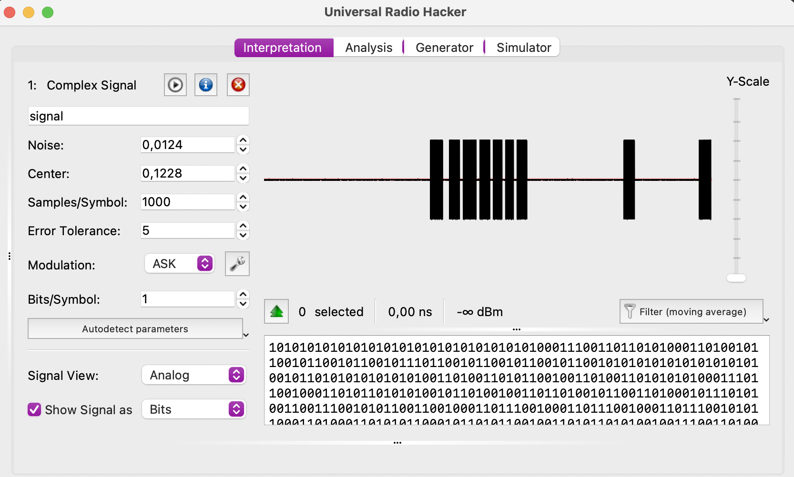

# Suspicious van

This has been my first radio signal challenge ever. I opened the signal file in [Universal Radio Hacker](https://github.com/jopohl/urh). I was a little bit lost in the settings, but it turned out the defaults were fine to solve the challenge. (I might clicked Autodetect parameters.)



Grabbed the decoded bits and went to the second stage. As I just learned, when someone trasmis bits over the air, the package usually starts with a preamble. Surely enough all lines started with `1010 1010 1010 1010 1010 1010 1010 1010 1010 0011 1001 1011`.

In hex this is:
```
a    a    a    a    a    a    a    a    a    3    9    b 
1010 1010 1010 1010 1010 1010 1010 1010 1010 0011 1001 1011
```

I searched for "aa aa aa aa a3 9b" and found a Google groups thread which forwarded me to `RadioHead ASK`. The challenge description also hinted that it has something to do with `RadioHead Packet Radio` and 433MHz and I somehow navigated to the [RadioHead ASK protocol implementation](https://github.com/merbanan/rtl_433/blob/282051b39da79336f2680d8f234dbf0a776a041a/src/devices/radiohead_ask.c#L33-L134).

However, it says that the preamble should be

```
    0x55, // 8
    0x55, // 16
    0x55, // 24
    0x51, // 32
    0xcd, // 40
```

Hmmm, almost... But if we add a leading 0 to the beginning of our preamble, we get:

```
5    5    5    5    5    5    5    5    5    1    c    d
0101 0101 0101 0101 0101 0101 0101 0101 0101 0001 1100 1101 1
```

Great! I had some more hickups with not realizing that the message bits are sent in LSB order, but at the and managed to port the relevant parts of the C code to (ugly) Python:

```python
def decode_msg(msg):

    # ported from https://github.com/merbanan/rtl_433/blob/282051b39da79336f2680d8f234dbf0a776a041a/src/devices/radiohead_ask.c#L33-L134

    def decode_6_to_4(symbol):
        symbol = int(symbol[::-1], 2) # reverse, because protocol uses LSBit first order
        symbols = [
            0x0d, 0x0e, 0x13, 0x15, 0x16, 0x19, 0x1a, 0x1c,
            0x23, 0x25, 0x26, 0x29, 0x2a, 0x2c, 0x32, 0x34
        ]
        return symbols.index(symbol)

    def read_byte():
        nonlocal msg
        hi, msg = decode_6_to_4(msg[:6]), msg[6:]
        low, msg = decode_6_to_4(msg[:6]), msg[6:]
        return (hi << 4) + low

    preamble, msg = msg[:35], msg[35:]  
    assert (int(preamble, 2) == 0x555555555)  # preamble of 10101 bit pattern

    start, msg = msg[:12], msg[12:]     
    assert (int(start[::-1],2) == 0xb38) # fix header 0xb38 (RH_ASK_START_SYMBOL) with LSBit first (i.e. bits reversed)

    length = read_byte() - 3 # message length includes the 'length byte', the payload and two closing bytes

    st = ''
    for i in range(length):
        b = read_byte()
        st = st + chr(b)
    print(st)

```

The output is something like this:
```
ÿÿ39C4BD7-INFO: --- Monitoring Station status report ---
ÿÿ39C4BD7-MSG: Power outage occured on 01/27/2022 at 14:37:29
ÿÿ39C4BD7-MSG: Connected to relay #87AB3FB1B7
ÿÿ39C4BD7-MSG: Last known RSSI: -38dBm
ÿÿ39C4BD7-MSG: Battery status: 76%
ÿÿ39C4BD7-INFO: --- End of status report ---
ÿÿ39C4BD7-INFO: --- Detected incoming message ---
ÿÿ39C4BD7-SNIFF: Captured signal: cd22{REDACTED}
```
