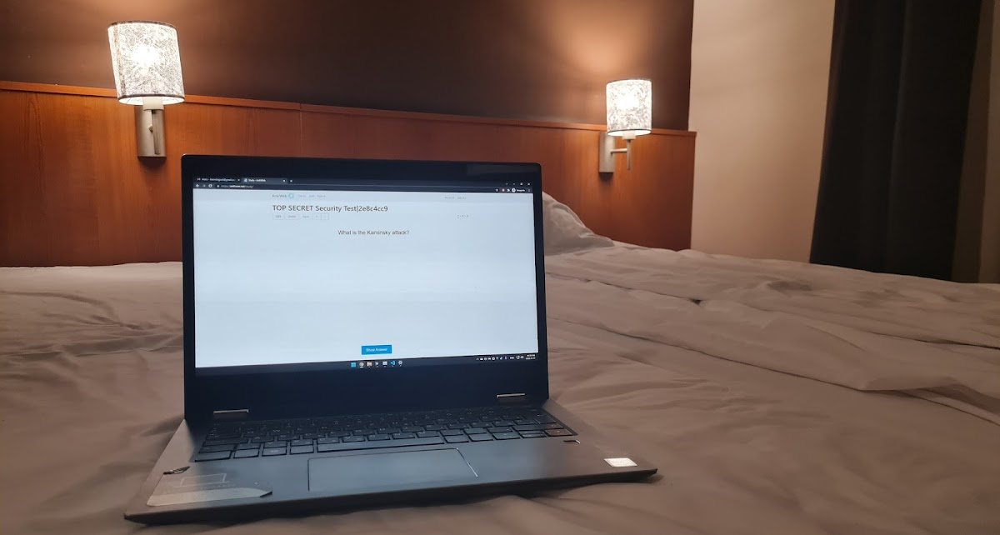

# Dangerous Volcano

I'm terrible at osint challenges, I asked Veloxer (the author) after the contest for hints. He said that I need to find some info associated to the gmail address that I found in the website's sources.

```html
<div class="person">
    <a href="mailto:themrbigjack@gmail.com">
    
    </a>
    <div class="bio">
    <h3>János Nagy</h3>
    <h4>Junior Penetration Tester</h4>
    He can hack some things!
    </div>
</div>
```

Here we go again. Our friend from last year strikes back. Now we are given his gmail address.

I found a nice tutorial here: https://medium.com/hacking-info-sec/how-to-gmail-osint-like-a-boss-1ca4f55f55e2

Folllowing this found Big Jack's userId `10144228658REDACTED` and a review from him on Google maps:

https://www.google.com/maps/contrib/10144228658REDACTED

This had a picture of a laptop, but it was too blurry to get more info out of it. 



I remembered from last year that there is a way to download these images in bigger resolution changing the end of the url:

https://lh5.googleusercontent.com/p/AF1QipPd1nBdLtdoW7U_UkTI5Mc_REDACTED=w1200-h642-p-k-no

https://lh5.googleusercontent.com/p/AF1QipPd1nBdLtdoW7U_UkTI5Mc_REDACTED=h14000

Now I got to a website, where I had to register. It's a site where you create cards to learn things. The cards have a front and a back, e.g to store a question and answer. You can build decks of these cards and share them with others. 

I used the info from the image to find Big Jacks' deck. After downloading, I had to extract it and look at the contents.

```shell
> file TOP_SECRET_Security_Test2e8c4cc9.apkg
TOP_SECRET_Security_Test2e8c4cc9.apkg: Zip archive data, at least v2.0 to extract
> unzip TOP_SECRET_Security_Test2e8c4cc9.apkg
  inflating: collection.anki2
  inflating: media
> file collection.anki2
collection.anki2: SQLite 3.x database, last written using SQLite version 3036000
```

This is an sqlite3 database, let's open it:
```shell
> sqlite3 collection.anki2
sqlite3 collection.anki2
SQLite version 3.32.3 2020-06-18 14:16:19
Enter ".help" for usage hints.
sqlite> .tables
cards   col     graves  notes   revlog
sqlite> select * from notes;
...
REDACTED
```

I found the flag in the notes table. It was some upside down text that I could copy paste into the CTF website.
