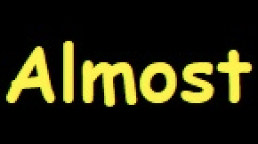
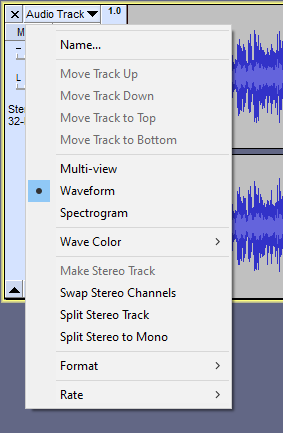
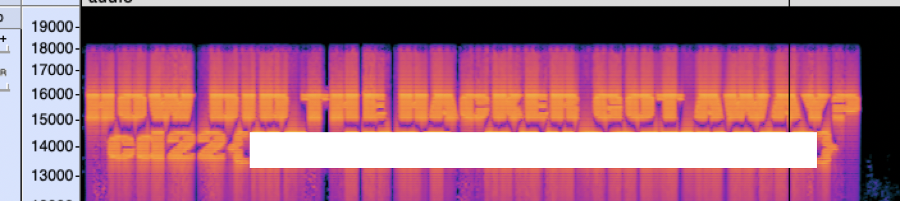

# G.O.A.T. 🐐

I could not solve this challenge, but I'm a completionist, so asked Velorex for hints. It was a multistep steganography challenge.

We can extract the frames from the provided .apng file with a tool called [apngdis](https://launchpad.net/ubuntu/bionic/+package/apngdis):

```shell
> ./apngdis movie.apng

APNG Disassembler 2.8

Reading 'movie.apng'...
extracting frame 1 of 428
extracting frame 2 of 428
...
```
Grab a ☕ until it works. 

Looking at the file sizes one of them stands out, frame 129 is somewhat bigger than the rest. I ran a versatile staganography tool called [zsteg](https://github.com/zed-0xff/zsteg) on it:

```shell
> zsteg apngframe129.png
imagedata           .. file: VAX-order 68k Blit mpx/mux executable
b1,b,lsb,xy         .. file: JPEG image data, JFIF standard 1.01, resolution (DPI), density 96x96, segment length 16, Exif Standard: [TIFF image data, big-endian, direntries=5, description=pw:MMmnhDmooeP1yaEt, xresolution=94, yresolution=102, resolutionunit=2]
b1,b,msb,xy         .. text: ["@" repeated 8 times]
b1,rgba,lsb,xy      .. text: "WuuWWuWu"
b1,abgr,msb,xy      .. text: "uWWuuWuW"
b2,r,lsb,xy         .. file: 5View capture file
b2,r,msb,xy         .. file: VISX image file
b2,g,lsb,xy         .. text: "UUUPUUUP"
b2,b,lsb,xy         .. file: VISX image file
b2,b,msb,xy         .. file: SoftQuad DESC or font file binary - version 650
b2,rgba,lsb,xy      .. text: "[;OCCGC7"
b2,abgr,msb,xy      .. text: "KKKKKKKKKKCKKCCCKKKKKKKKKKKCCCCC"
b3,abgr,msb,xy      .. text: "gvfgvfgvfgvfgvfGvfgvdGvdgvfgvfgvfgvfgvfgvdGvdGvdGr$Gr$Gr$Gr$Gr$"
b4,r,lsb,xy         .. text: "ffffffffffffffffDDDDDUUEEUU"
b4,r,msb,xy         .. text: "ffffffffffffffff\"\"\"\"\""
b4,g,lsb,xy         .. text: "DDDDDDDDDDDDDDDDDDDDD33E4DDy"
b4,g,msb,xy         .. text: ["\"" repeated 21 times]
b4,b,lsb,xy         .. text: "gigwvfgvvggvgvffffffff"
b4,b,msb,xy         .. text: "nffffffff"
```

Zsteg found a JPEG signature for us and tells us how it was encoded. Let's try to extract it:

```
> zsteg --extract 'b1,b,lsb,xy' apngframe129.png > x.jpg
```

That's what we got:



(Well 'almost' what we got. This is a screenshot of the original image.) Let's run binwalk on it:
```shell
> binwalk x.jpg

DECIMAL       HEXADECIMAL     DESCRIPTION
--------------------------------------------------------------------------------
0             0x0             JPEG image data, JFIF standard 1.01
30            0x1E            TIFF image data, big-endian, offset of first image directory: 8
5454          0x154E          Zip archive data, encrypted at least v2.0 to extract, compressed size: 245239, uncompressed size: 255984, name: audio.mp3
250823        0x3D3C7         End of Zip archive, footer length: 22
```

There is a .zip file appended to the JPEG. 
```
> binwalk -e x.jpg
> cd _x.jpg.extracted/
> ls -la
total 496
drwxr-xr-x    4 encse  staff     128 Mar 24 07:24 .
drwxr-xr-x  435 encse  staff   13920 Mar 24 07:24 ..
-rw-r--r--    1 encse  staff  253746 Mar 24 07:24 154E.zip
-rw-r--r--    1 encse  staff       0 Feb  5 23:01 audio.mp3
```

Binwalk extracted the zip and an empty audio.mp3. Let's try to unzip:
```shell
>  unzip 154E.zip
Archive:  154E.zip
[154E.zip] audio.mp3 password:
```

Ok, we need a password, back to the 'Almost' image:
```
> strings ../x.jpg
...
pw:REDACTED
...
```

Here it is. Using the password we can extract the zip, which has audio.mp3 (this time not empty) in it. 

If you play the .mp3, there is some weird high frequency nosie in the background, this would be a hint for the next step, but I just opened it in [Audacity](https://www.audacityteam.org/), because Velorex told me that I should check the spectrogram of the audio file. Hiding an image inside an audio is a decade old trick from hackme sites. 

I can switch to Spectogram view in Audacity with opening the Audio Track dropdown:


And there is the final answer:
