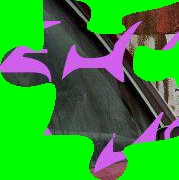
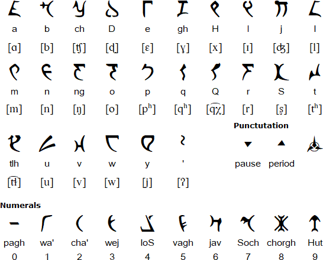

# piecemaker

The tar file contained a bunch of jpegs with a puzzle piece in each:



I have `imagemagick` installed and could quickly remove the green background from the files with:

```shell
> magick mogrify -format png -fuzz 5% -transparent '#02ff00' *.jpg
```

Opened my image editor, imported all pieces and soon after got the following picture:


This is a Peacemaker poster with some Klingon characters layed on top of it. Klingon can be transcribed to latin using this table:



Some more labor reveals the following:

```
this is christopfer smith known as peacemaker 
I love formule one aka f1 as well as f3 but 
you know what would be even better f5 
I also love java but scripting should be banned 
the whole password is in gold
```

My friend told me after the contest that this is referring to the F5 steganography tool which has a Java and a Javascript implementation as well. Based on the text we should probably use the Java one, available here: https://code.google.com/archive/p/f5-steganography/

The text also says that the 'whole password is in gold'. Let's transcribe the yellow lines as well (not visible in the picture above, because I don't want to take all the fun from you).

The password was an English sentence, all lowercase with spaces but no punctuation. I fed it into f5.jar and ran it over the jpegs like this:

```shell
> for f in *.jpg; \
do java -jar f5.jar x -p 'REDACTED' -e $f.txt $f; \
done
```

I didn't have the right java version installed, so spinned up a docker machine and ran it inside:

```shell
docker run -it -v $(pwd):/pics openjdk:11 /bin/bash
```

That worked and created a bunch of new files for me. I was expecting to have .txt files, but most of them were tar.gz-s instead :) That was the point where tcs, the author of the challenge, had to push me into the right direction...

```shell
> file *.txt
0300bb178ebe44954a57cdb5631272b122d3366061e6e03aca4c0a271ddf34c1.jpg.txt: gzip compressed data, from Unix, original size modulo 2^32 10240
0317dfe9ec7f42f1354168da96a081ea83a6e486a6421550e533ee71b7bc09d1.jpg.txt: gzip compressed data, from Unix, original size modulo 2^32 10240
0675ea882d8c075118d010c70e97bb2bd4ec034b65a0bdf14237f50ecc040075.jpg.txt: gzip compressed data, from Unix, original size modulo 2^32 10240
...
```

Extracted the files like this:

```shell
for f in *.txt; do tar -xf $f; done
```

Guess what? I got a bunch of .png files and each of them had an other puzzle piece in it... We heard you like puzzles so we put a puzzle inside your puzzle... I went back to my image editor and after an hour of puzzling I finally got the flag:


Again, the relevant parts are deleted, so that you can work it out yourselves.


